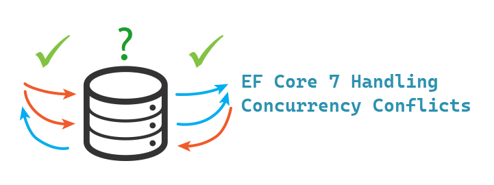
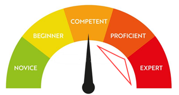

The average developer tends not to think about `concurrency violations` until it happens which can compromise critical data. Dependent on their proficiency with C# and EF Core if at a novice level to intermediate level figuring out how to deal with concurrency violations may very well halt coding for hours or days until they master dealing with concurrency violations.

Although Microsoft provides a simple example, this article and code samples will assist in mastering dealing with concurrency violations. Please note that it is impossible to cover all scenarios but using provided code will assist in other cases not covered.

One might say, I only write applications for myself. Well this is said by many who later go on to share their work and end up with concurrency violations. For those developer consider cloning the repository for a possible future where this might happen.

> **Note**
> Before running the project TaxpayersConcurrencyCheck, run TaxpayerMocking to create the database.

| Project        |   Description    |
|:------------- |:-------------|
| TaxpayerMocking | Used to create and populate a SQL-Server localDb database | 
| TaxpayerLibraryEntityVersion | data operations  | 
| TaxpayersConcurrencyCheck | Main project for working with concurrencies | 

> **Note**
> Article is in [Readme](TaxpayersConcurrencyCheck/readme.md)

## Knowlege level for C# and Entity Framework Core

